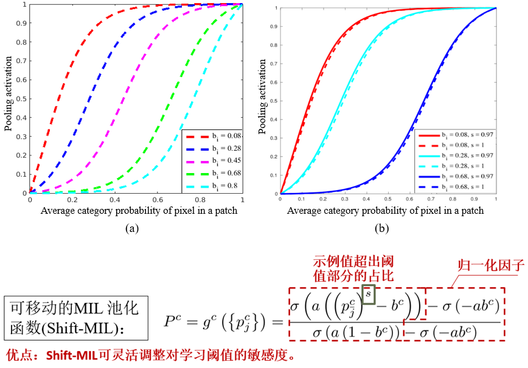

# Shift-MIL Pooling and Application
Shift MIL pooling layer based on Noise-And for Classification and Segmentation. It is the implementation of Shift-MIL pooling function based on "Surface Defect Segmentation with Multi-Column patch-wise U-net" by Zihao et al.

## Mathematics Equation and curve 
 

## Requirements

Tensorflow >= 1.9

Keras >= 2.2

Numpy

## Training and evaluation 

**(1) Classification on MNIST:** python shift_mil.py 

**(2)Segmentation on DAGM 2007 (Weakly-surpvised Learning):** 

**[Training stage]**

python prepare_datasets_DAGM.py
python run_training.py

